# Large Language Models

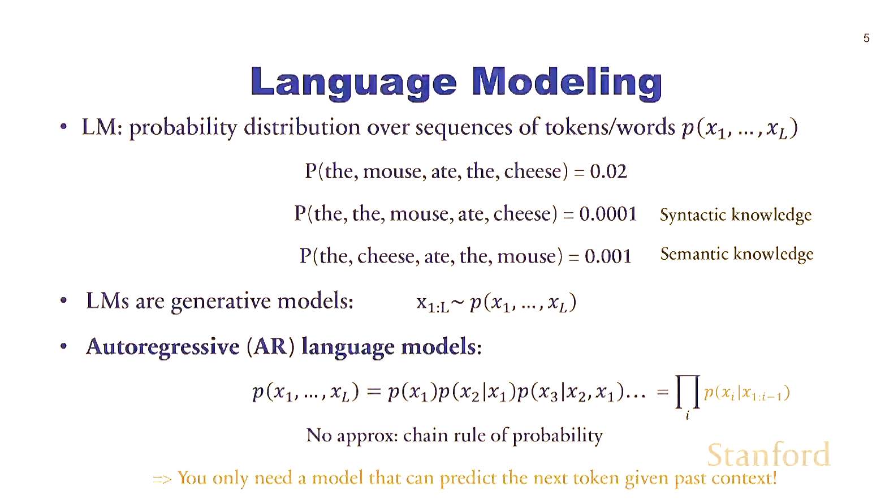

[text](01_LLMs_Theory.md) 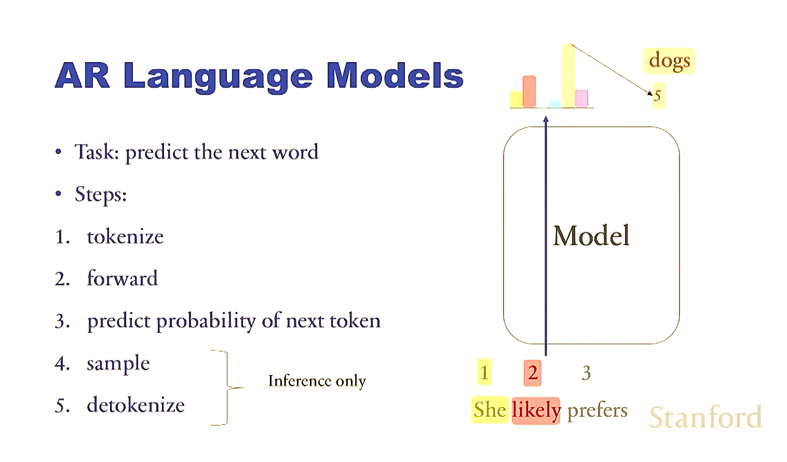 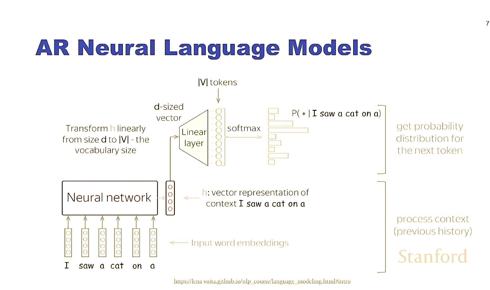 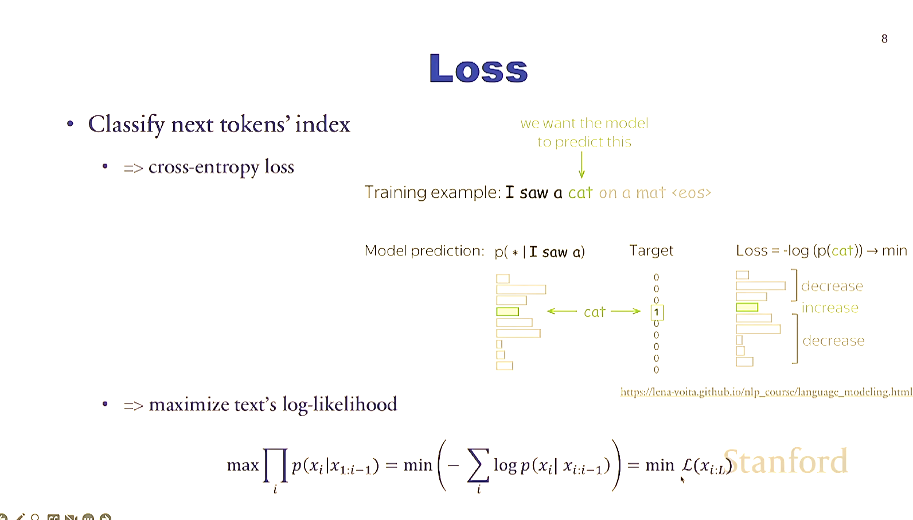 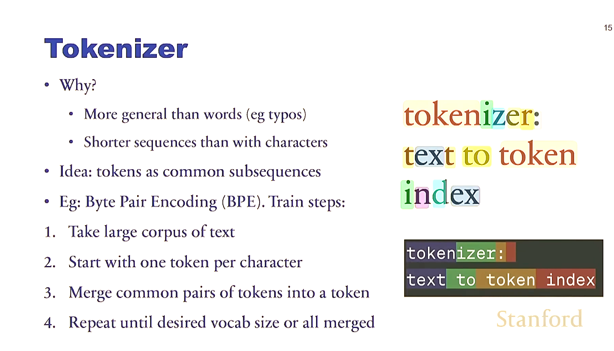

## Post Training
We need post training to make AI assitants. LLMs are jsut predictors of what comes next

[text](01_LLMs_Theory.md) 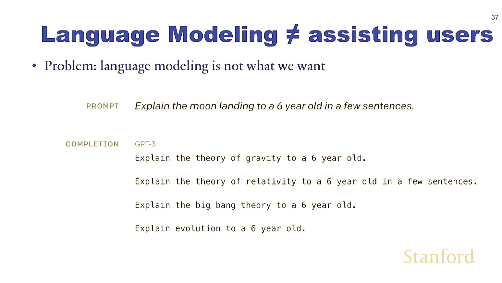 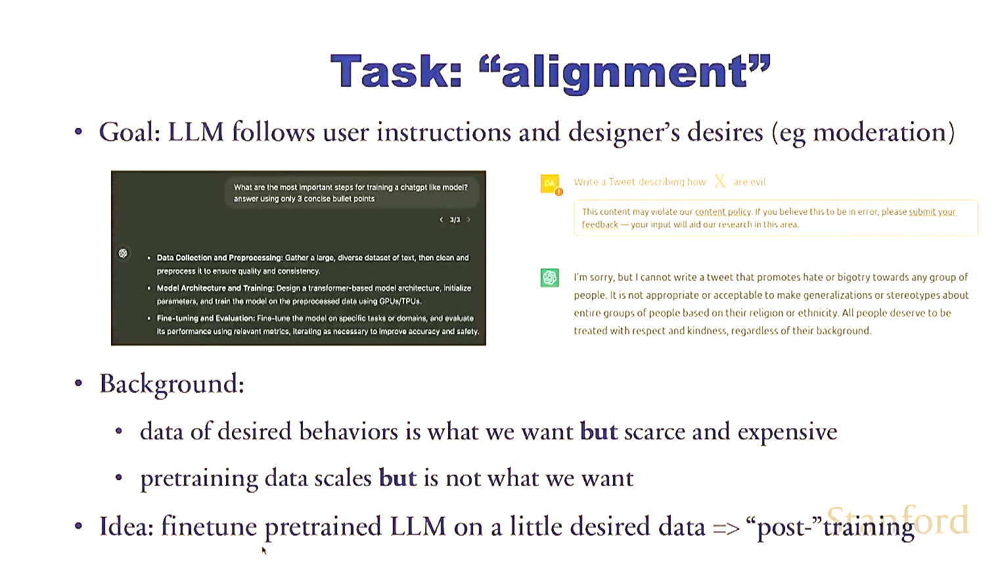 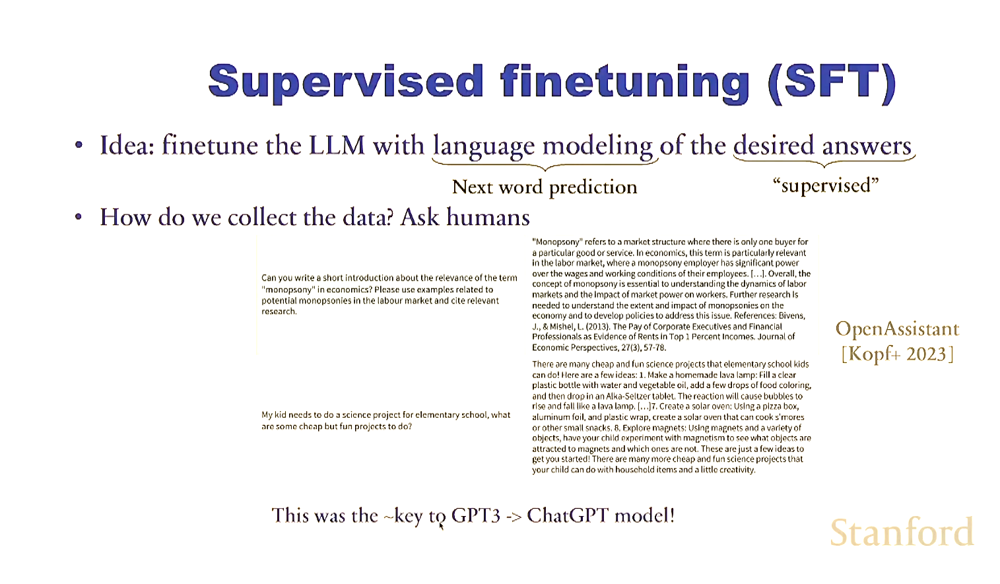

### Reinforcement Learning

[text](resources) 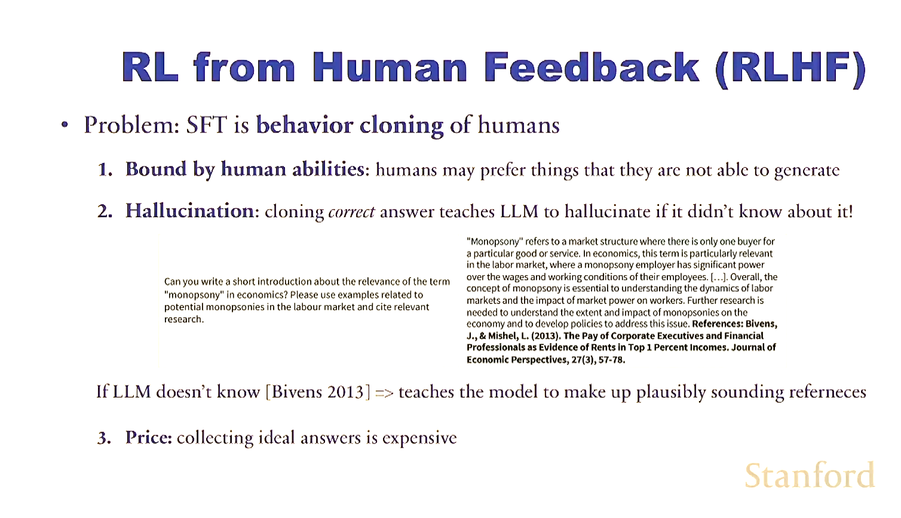 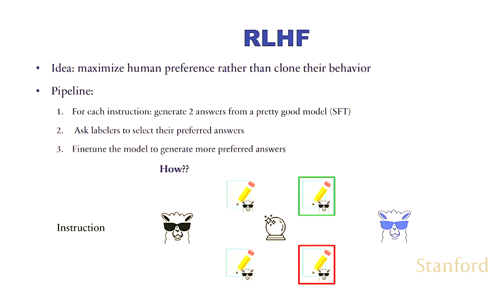 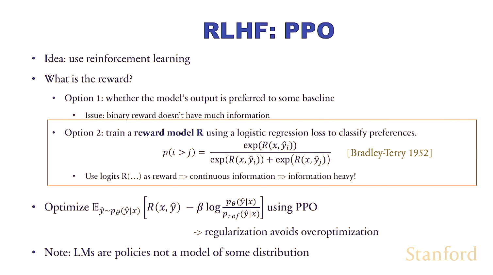 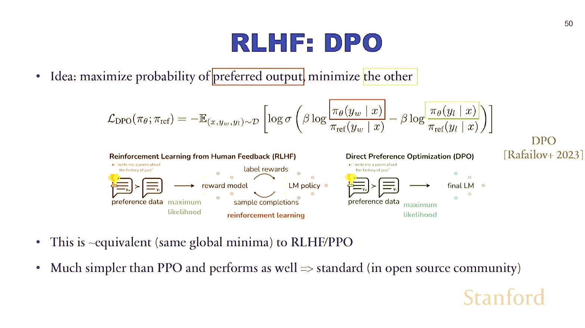

