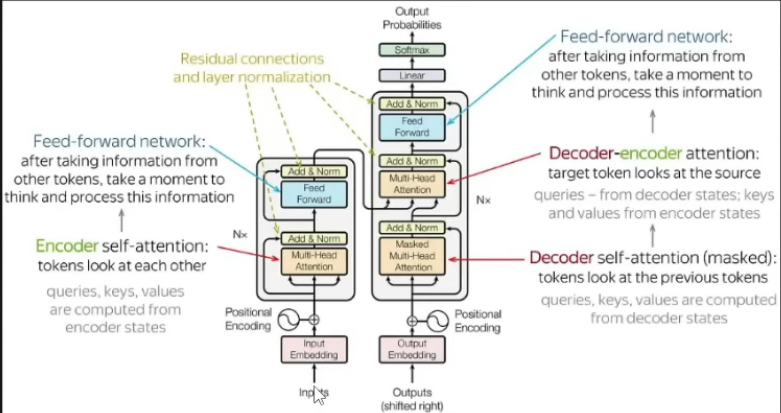
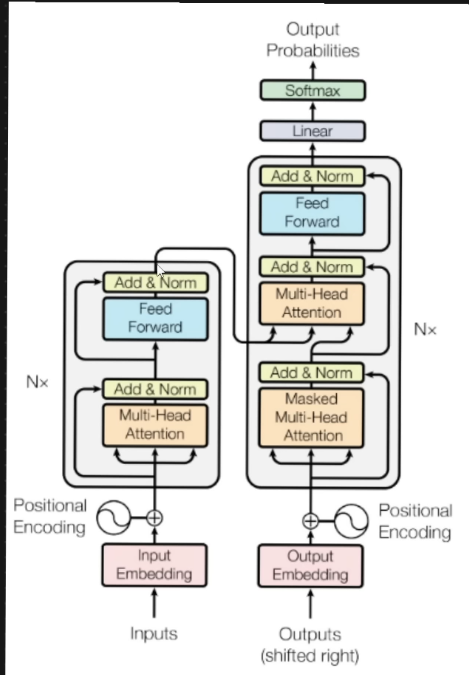

# Transformer Architecture

Encoder decorder limitation was when sentence length increases the context passed to decoder was not enough. Bleau Score decreases.

This problem can be solved by Attention mechanism.

With this we are able to provide additional context to the decorder.
In the above we are using Bi directional LSTM, RNN.

## Problem with Attention Mechanism and how Transformers fix it
### Parallel input processing
- We send each word based on timestamp. So we cannot parallaly send all the words in a sentence. So the model is not scalable wrt to training
- Transformers never use LSTM RNN encoders decoders, rather they use **Self Attention Module** (All the words will be parallely sent to the encoder)
- We Will learn here positional encoding since we are sending all inputs together
- With Transformers : As we keep increasing data set we will get some state of the art (SOTA) models.
- Transformers also work in multi model task : NLP + Image
- Transformers have changed the AI space
- From GPT BERT -> Transfer Learning -> SOTA models -> like DALLE
- Various LLM models are used in Generative AI
- 
### Contextual Embedding
- When we pass our input through an Embedding layer, it converts all the words in the sentence to a vector we call embedding vector using word2vec for example.
- But these does not have Contextual vector.
  - for ex: **I am Vishnu and I play Badminton.**
    - In above line **I** is realted to **Vishnu** also **Badminton**  is associated with **Vishnu**
    - So we need some contextual Embedding layer that can produce vectors that are not just plaijn vectors in embedding vector but should also have some context about the relation between words in the sentence.
    - THIS PROBLEM IS SOLVE BY **SELF ATTENTION MODEL**
    - Becuase of this our models will be very accurate

## Transformer Architecture

### Basic Transformer Architecture
- We are doing a seq2seq task for ex: Language Transaltion lets suppose from Eng -> French

- So input is English and output is French
- Now we go into the transformer block above
  

- Transformer also follows an Encoder Decoder architecture
- Inside the encode we can have multiple encoders step by step, similarly for decoder as well
- In the research paper. **"ATTENTION IS ALL YOU NEED"**, they have used 6 encoders and decoders
  
- Inside single encoder we can see that there are 2 layers
  - Feed Forward Neural Network
  - Self Attention layer
- Inside a Single decoder we can see that we have 3 layers
  - Feed Forward Neural Network
  - Encoder-Decoder Attention
  - Self Attention layer

- Now Lets Dig into the Encoder further

-  Once the inputs are converted into vector using some embedding layer like word2vec
-  These vectors are passed to the self attention layer.
-  Self attention layer converts these vectors inot Contextual vectors.
-  Which are then passed to the Feed Forward layer
-  Output from the Feed Forward neural network is passed to the next Encoder
-  In which the same process repeats

### ENCODER

#### Self Attention at a higher level
Self-attention, also known as scaled dot-product attention, is a crucial mechanism in the transformer architecture that allows the model to weigh the importance of different tokens in the input sequence relative to each other

.png>)

- We need to derive 3 important vectors
  - **Queries Vector (Q)**
    - Query vector represent the token for which we are calculating the attention. They help determine the importance of other tokesn in the context of the current token
    - Importance:
      - **Focus Determination**:
        - Queries help the model decide which parts of the sequence to focus on for each specific token. By calculating the dot product between a query vector and all key vectors, the model assesses how much attention to give to each token relative to the current token
      - **Contextual Understanding**:
        - Queries contribute to understanding the relationship between the current token and the rest of the sequence, which is essential for capturing dependencies and context
        - 
  - **Keys Vectors (K)**
    - Role: Key Vectors represent all the tokens in the sequence and are used to compare with query vectors to calculate attention scores.
    - Importance:
      - **Relevance Measurement**:
        - Keys are compared with queries to measure the relevance or compatibility of each token with current token. This comparison helps in determining how much attention each token should receive.
      - **Information Retrieval**
        - Keys play a critical role in retrieving the most relevant information from the sequence by providing a basis for the attention mechanism to compute similarity scores.
  - **Values Vectors (V)**
    - Role: Value vectors hold the actual information that will be aggregated to form the output of the attention mechanism.
    - Importance:
      - **Information Aggregation**:
        - Values contain data that will be weighted by the attention scores. The weighted sum of values forms the output of the self attention mechanism, which is then passed on to the next layers in the network.
      - **Context Preservation**:
        - By weighting the values according to the attention scores, the model preserves and aggregates relevant context from the entire sequence, which is crucial for tasks like translation, summarization, and more.

#### Steps (THE CAT SAT)
- **Get Embedding tokens**
- **Linear Transformation** : Dot product of embedding vector with learned weights (ex: now lets suppose identity matrix) which gives the value of K,Q,V  =>  The : [1010] Cat : [0101] Sat : [1111]
- **Compute Attention Scores** :
  - For The
    - Score (Q_The , K_The) = 2
    - Score (Q_The, K_Cat) = 0
    - Score (Q_The, K_Sat) = 2
  - For Cat
    - Score(Q_Cat, K_The) = 0
    - Score(Q_Cat, K_Cat) = 2
    - Score(Q_Cat, K_Sat) = 2
  - For Sat
    - Score(Q_Sat, K_The) = 2
    - Score(Q_Sat, K_Cat) = 2
    - Score(Q_Sat, K_Sat) = 4
- **Scaling** :
  - We take the scores and scale down by dividing the scores by the square root of dimensions of the key vector (K)
  - Scaling in attention mechanism is crucial to prevent the dot prodcut from growing too large
    - To ensure stable gradients during training
    - dk (dimensions of K vector) is large then :
      - Gradient Exploading issue
      - Softmax Saturation
- **Property of Softmax** :
  - softmax give probailities from the score which is ATTENTION WEIGHTS
- **Weighted Sum of values** :
  - We multipley the attention wieghts by value vectors

#### All the above steps can be referred : https://jalammar.github.io/illustrated-transformer/

#### Multi Head Attention
- We have a self attention with multiple heads for the same word
- We use different learned weights while calculating the K, Q, V
- Multi head expands the model's ability to focus on different position of tokens
- All these needs to be passed to feed forward neural network, so we will have to combine multi head attention
- We concatenate all the multi heads into a single matrix and then dot prodcut with a weight (W0) for Feed Forward NN
- And then passed on

#### Positional Encoding
- Because of the advantage of parallel processing. Now the model lacks the sequential orderijng of the words.
- Due to which
  - LION KILLS TIGER
  - TIGER KILLS LION
  - both become same sentence for the model.
- We use positional encoding to solve this problem
- smae as Embedding vector for each word we will create positional encoding vector
- then positional encoding vector gets added to the embedding vector

##### Types of positional encoding
- Sinusoidal PE
  - It uses sine and cosine functions of different frequencies to create positional encodings
  - We cannot use just sine function because then there can be conflict in positions of different token embeddings.
  - So we use alternatively both sine and cosine
- Learned PE
  - Postional encodings are learned during training (back propogation and learning)

#### Layer Normalization
- Vector that we get by adding embedding vector and positional encoded vector is passed to the Attention layer, but it is also passed to the normalization layer as well, which is called as **RESIDUALS**
- This provides additional information to the addition and normalization layer
- Normalization :
  - Batch Normalization
    - We calculate the mean and std_dev and try to make them 0 and 1 respectively.
    - This makes data centered around zero and brings stability to the model
    - In batch the z score for all the values of a feature is calcdulated together in batches as a column
  - Layer Normalization
    - In layer normalisation row wise calculation happens first score of each feature like that
    - In Transformers we apply layer normalizsation because if we do batch and we have lot of zeroes in the z score column then it will impact the model. but in layer it does not cause that impact
- In Learned normalization we use gamma and beeta.
- Y = Gamma [(z - mean) / variance] + beeta, z = score after activation function
- Here Gamma and Beeta are called Scale and Shift parameters

#### Residual Connection
- Addressing the vanishing gradient problem
- Residual connection creates a short path for gradient to flow directly through the network. Gradient remains sufficiently large.
- It improves gradient flow. Means convergence to global minima will be faster.
- Enables training of deeper networks

#### WHy Feed Forward Neural Network ?
- To capture more information we use feed forward NN. It solved the non linear function
- It adds non linearity
- Processing each position independently
- Helps transform the representation from self attention and allows the model to learn richer representation
- Adds depth to the model, means more learnings
- It also increases the model parameters

### DECODER
The transformer decoder is responsible for generating the output sequence one token at a time, using the encoder's output and the previously generated tokens

As we can see the encoder output is given to transformer decoder multi-head attention (Encoder Decoder Attention).
Decoder generates output sequentially not parallely
- There are two ways a decoder works:
  - Training Mechanism 
  - Inference Mechanism.
In Training we also give real input to the masked multi head attention

1. Masked Multi Head Attention
   1. Output shifted to right (adding additional padding to the output), makes sequences length equal
   2. Input Embedding and Positional Embedding
   3. Linear Projection for Q,K,V
   4. Scaled Dot Product Attention
   5. Mask Application (only extra step from Multi head attention) : It helps managing the structure of the sequences being processed and ensures the model behaves correctly during training ang inferencing
      1. Reaosns :
         1. Handling variable length sequences with padding masking.
      2. Purpose :
         1. To handle sequences of different length in batch
         2. To ensure that padding tokens which are added to make sequences of uniform length do not affect the model prediction
      3. Types : Input [4, 5, 0]
         1. Padding Mask
            1. It ignores the padding added to the output
            2. [[1, 1, 0], [1, 1, 0], [0, 0, 0]]
         2. Look Ahead Mask
            1. Used to maintain **auto regressive** property
            2. To ensure that each position in the decoder output sequence can only attend to the previous position but no future position
            3. Essential sequence to sequence tasks : Translations etc.
            4. [[1, 0, 0], [1, 1, 0], [1, 1, 1]]
      4. Functionality
         1. For each token the mask should indicate which token it can attend to
         2. A token should not attend (auto regressive) to a masked token
      5. We combine padding and Look Ahead mask (dot operation)
         1. [[1, 0, 0], [1, 1, 0], [0, 0, 0]]
      6. Whereever the value is 0 in combined mask we add it with minus **infinity** before applying
         1. [ [ 1, -inf, -inf ], [ 1, 1, -inf ], [ -inf, -inf, -inf ] ]
      7. Softmax (masked * scores)
      8. Weighted Sum of value
   6. Multi head attention mechanism
   7. Concatenation and final linear projection
   8. Residual Connection and Layer Normalisation
   
2. Multi Head Attention (Encoder Decoder Attention)
   1. K, V from encoder output is given to this layer.
   2. Q will be coming from the masked multi head attention layer output after normalizsation
3. Feed Forward NN
4. Linear & Softmax
   1. Now we have output vectors, now how we convert output vectors into output words
   2. Linear layer is a simple fully connected NN that projects the vector produced by the stack of decoders.
      1. It produces Logits Vector of voccab size which is essentially a score for all words in the voccab.
   3. Softmax layer
      1. This converts the Logits vector scores to a probabilities. (summation will add up to 1)
      2. The cell with the highest probability is choosen as the ouput and the word associated with it is produced as the output for that specific timestamp.
